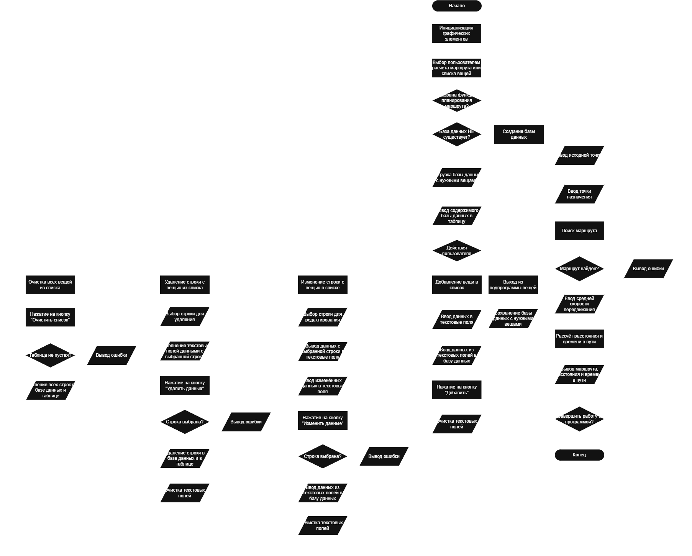
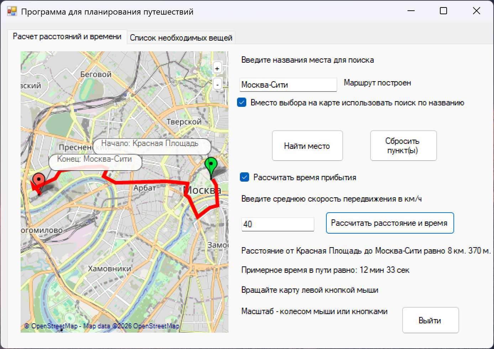
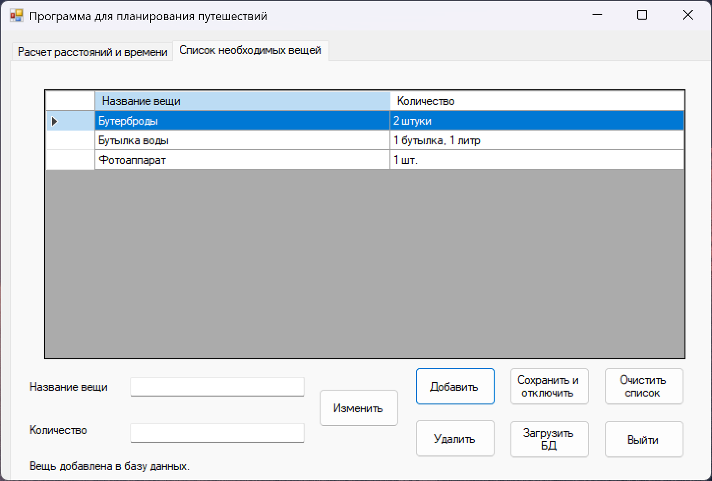

# Задание на производственную практику

## Разработать алгоритм в виде блок-схемы решения задачи для выбранной предметной области  

### Изображение блок-схемы

## Разработать, протестировать и отладить программный код, реализующий алгоритм

Тема:  Программа для планирования путешествий  

Программа: Программа для создания маршрутов и планирования поездок  

Алгоритм: ввод пунктов назначения, расчет расстояний и времени в пути, создание списка необходимых вещей  

Список необходимых вещей использует базу данных SQLite, карта использует пакет GMap.NET

### Интерфейс программы

  

